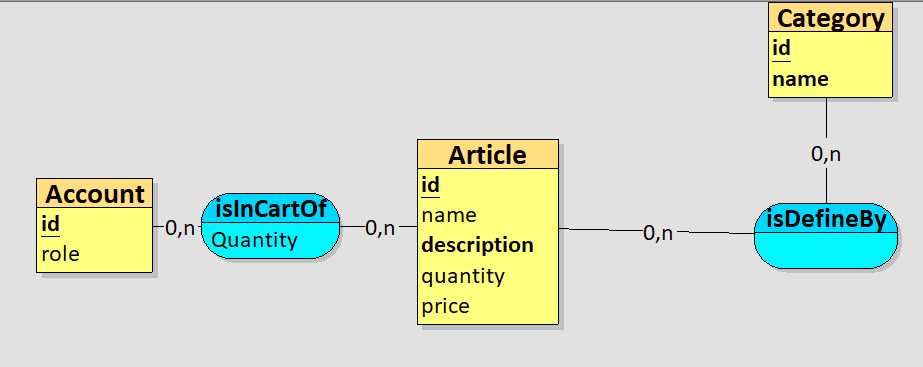

# AMT

## Backlog
[https://nicolas-glassey.gitbook.io/amt-backlog/](https://nicolas-glassey.gitbook.io/amt-backlog/)

<br/>

## Connexions au serveur AWS
### Tunnel ssh et tunnel pour la console d'administration
`ssh -L 23:10.0.1.21:22 -L 8081:10.0.1.21:8080 -L 4849:10.0.1.21:4848 [userName]@16.170.194.237 -i "[pathToDmzSshKey.pem]"`

### Connexion ssh
`ssh [userName]@localhost -p 23 -i "[pathToApplicationServerSshKey.pem]"`

</br>

## Developpement local
### Serveur d'application
Tomcat v9 (https://tomcat.apache.org/download-90.cgi)

**Configuration de la onsole d'administration**
Modifier le fichier `<path>/tomcat/apache-tomcat-9.0.54/conf/tomcat-users.xml` </br>
- Décommenter les rôles du manager </br>
- Aouter un mot de passe pour chaque rôle </br>
````xml
  <user username="admin" password="admin" roles="manager-gui"/>
  <user username="robot" password="robot" roles="manager-script"/>
````

**Interfaces web**
- Application: localhost:8080
- Console admin: localhost:8080/manager/html
  - login: admin:admin  

### Bases de donnée
MariaDB (https://mariadb.org/download)

## MCD

